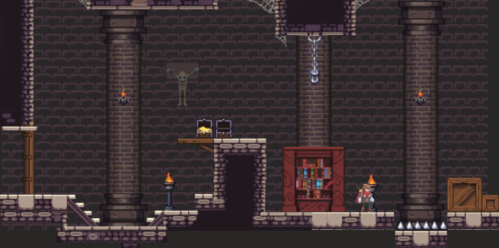

# Thrones-and-Dragons
Thrones and Dragons is a fantasy 2D platformer game created in Unity 

## 🎮  Controls 
- Move the character left/right:
  ### **← →**

- Jump:
  ### **↑**

- Attack:
  #### **Space**

## 🛠️ Technical Features

- Engine: Unity 6.1 (6000.1.12f1)

- Language: C#

- Physics: Rigidbody2D + BoxCollider2D

- Key scripts:

  - PlayerController.cs: Handles Player movement, game score and number of lifes

  - CheckGround.cs: Checks when the Player is grounded

  - **PersistentManagerScript.cs:** Stores data between scenes
  - **DragonController.cs:** Handles Dragon enemy movement including attacks, its lifes and damage to the Player
  - **MovingPlatform.cs:** This script can be reused to create a moving platform that moves indefinitely from a Starting Point to an End Point
  - **FallingPlatform.cs:** This script can be reused to create a platform that falls if the Player jumps into it

## 📁 Project Structure
- #### Animations
  Contains .anim files and animation controllers that define how objects or characters animate over time.
- #### Fonts
  Holds custom font assets used for UI text and other in-game typography.
- #### Graphics
  General graphical assets such as logos, UI elements, or textures not categorized under sprites.
- #### Materials
  Includes material assets that define how objects appear visually (color, texture, shader).
- #### Paletes
  Contains tile palette assets used with the Tilemap system in Unity to paint tiles in your levels.
- #### Prefabs
  Contains reusable GameObject templates (like characters, platforms, enemies) that can be instantiated in scenes.
- #### Scenes
  Holds Unity scene files (.unity)—each file is a different level, menu, or game state.
- #### Scripts
  Includes all C# scripts (.cs) that control game logic, behavior, and interactions.
- #### Sprites
  Contains 2D images and sprite sheets used for visual elements like characters, tiles, or icons.

## ✅ Implemented Features

- Player movement, attack and jumping
- Player ground collision detection
- Score tracking
- Data persistence between scenes

## 📸 Screenshots

### Castle Scene

